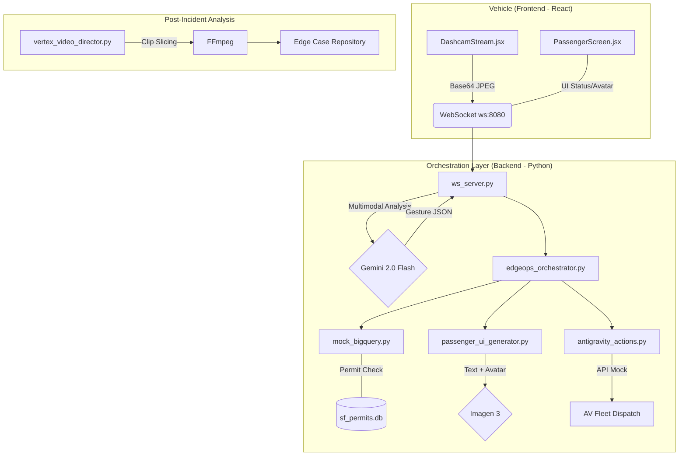

# 🚀 RocketRide EdgeOps

**EdgeOps** is a real-time autonomous vehicle (AV) incident orchestration platform built for the RocketRide fleet. It bridges the gap between on-vehicle vision (dashcam), city-scale data (permits/closures), and human-centric intervention.

## 💡 The Idea
Autonomous vehicles often encounter ambiguous "edge cases" on San Francisco streets—like a construction worker's hand signal or an unpermitted utility break. EdgeOps uses **Gemini 2.0 Flash** to analyze these frames live, verifies them against a **BigQuery-mocked permit database**, and automatically decide between:
1. **Executing an AI Reroute** (if the closure is known/permitted).
2. **Dispatching Human Rescue** (if the anomaly is unpermitted).
3. **Generating Dynamic Passenger UX** (using **Imagen 3**) to reassure riders with real-time, context-aware avatars.

---

## 🏗️ System Design



---

## 🛠️ Tools & Tech Stack

- **AI/ML**: 
    - **Gemini 2.0 Flash**: Live multimodal frame analysis and status copywriting.
    - **Imagen 3**: Dynamic generation of passenger-facing AV chauffeur avatars.
    - **Vertex AI GenAI SDK**: Powering video analysis for the post-incident pipeline.
- **Backend**: Python (Asyncio, Websockets, SQLite/BigQuery Mock).
- **Frontend**: React (Webcam API, WebSocket streaming, Luxury Terminal UI).
- **Media**: FFmpeg (Automated video labeling and clip extraction).
- **CLI/UX**: `rich` library for a professional-grade live terminal dashboard.

---

## 🚀 Local Setup & Installation

### 1. Prerequisites
- **Python 3.9+**
- **FFmpeg** (v4.0+ for video overlays)
- **Git**
- **Google Generative AI API Key** (Gemini)

### 2. Install Dependencies
```bash
pip install websockets pillow google-generativeai rich
```

### 3. Environment Configuration
Set your Gemini API key in your terminal session:
```bash
# Windows (PowerShell)
$env:GEMINI_API_KEY="your-api-key-here"

# Linux/Mac
export GEMINI_API_KEY="your-api-key-here"
```

---

## 🎮 Running the Demo

### Phase 1: Start the Orchestrator
Launch the main dashboard to initialize the WebSocket server and the local permits database:
```bash
python main.py
```

### Phase 2: Start the Dashcam (React)
Import `DashcamStream.jsx` into your React app and run your dev server. 
- Point your webcam at the screen.
- Use the **"SIMULATE INCIDENT"** button or hold up a "Stop" hand gesture to trigger the pipeline.

### Phase 3: Inspect the Logs
Watch the **Rich Dashboard** in your terminal as it pulses blue, queries the SQLite DB, calls Imagen 3, and dispatches the AV reroute command.

### Phase 4: Video Director (Post-Incident)
Once the demo completes, run the automated video slicer:
```bash
python vertex_video_director.py sample_dashcam.mp4
```

---

## 📂 Project Structure
- `main.py`: The master CLI dashboard for the demo.
- `ws_server.py`: WebSocket gateway linking React to Gemini.
- `edgeops_orchestrator.py`: Logic for Verify -> Decide -> Act.
- `mock_bigquery.py`: SQLite-powered SF permit database.
- `passenger_ui_generator.py`: Imagen 3 / Gemini UX component.
- `vertex_video_director.py`: FFmpeg video slicing automation.
- `DashcamStream.jsx`: Client-side webcam streaming.
- `PassengerScreen.jsx`: Luxury in-car passenger UI.

---

*Built for the Build with AI Hackathon @ RocketRide.*
