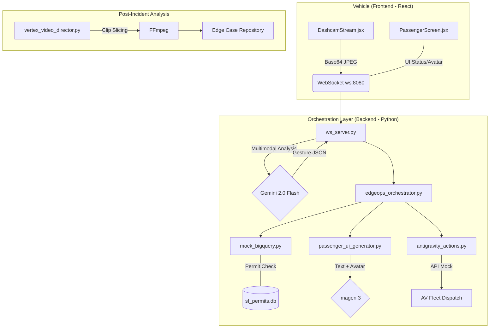

# 🚀 RocketRide EdgeOps

**EdgeOps** is a real-time autonomous vehicle (AV) incident orchestration platform built for the RocketRide fleet. It bridges the gap between on-vehicle vision (dashcam), city-scale data (permits/closures), and human-centric intervention.

## 💡 The Idea
Autonomous vehicles often encounter ambiguous "edge cases" on San Francisco streets—like a construction worker's hand signal or an unpermitted utility break. EdgeOps uses **Gemini 2.0 Flash** to analyze these frames live, verifies them against a **BigQuery-mocked permit database**, and automatically decide between:
1. **Executing an AI Reroute** (if the closure is known/permitted).
2. **Dispatching Human Rescue** (if the anomaly is unpermitted).
3. **Generating Dynamic Passenger UX** (using **Imagen 3**) to reassure riders with real-time, context-aware avatars.

---

## 🏗️ System Design



---

## 🛠️ Tools & Tech Stack

- **AI/ML**: 
    - **Gemini 2.0 Flash**: Live multimodal frame analysis and status copywriting.
    - **Imagen 3**: Dynamic generation of passenger-facing AV chauffeur avatars.
    - **Vertex AI GenAI SDK**: Powering video analysis for the post-incident pipeline.
- **Backend**: Python (Asyncio, Websockets, SQLite/BigQuery Mock, Dotenv).
- **Frontend**: React (Webcam API, WebSocket streaming, Luxury Terminal UI).
- **Media**: FFmpeg (Automated video labeling and clip extraction).
- **CLI/UX**: `rich` library for a professional-grade live terminal dashboard.

---

## 🚀 Local Setup & Installation

### 1. Prerequisites
- **Python 3.10+**
- **Node.js / npm**
- **FFmpeg** 
- **Google Generative AI API Key** (Gemini)

### 2. Install Dependencies
```bash
# Backend
pip install websockets pillow google-generativeai rich python-dotenv

# Frontend
npm install
```

### 3. Environment Configuration
Create a `.env` file in the root directory (rename from `.env.example`):
```bash
GEMINI_API_KEY="your-api-key-here"
```

---

## 🎮 Running the Demo

### Phase 1: Start the Dashboard (Backend)
Launch the master terminal dashboard:
```bash
python main.py
```

### Phase 2: Start the Dashcam (Frontend)
Run the Vite development server on the alternative port:
```bash
npx vite --port 8888 --host
```

### Phase 3: Inspect the Logs
Open **http://localhost:8888** in a browser (Incognito recommended). 
Watch the terminal dashboard as it pulses blue, queries the SQLite DB, and triggers the AI reroute logic.

---

## 📂 Project Structure
- `main.py`: The master CLI dashboard and orchestrator.
- `ws_server.py`: WebSocket gateway linking React to Gemini.
- `edgeops_orchestrator.py`: Logic for Verify -> Decide -> Act.
- `mock_bigquery.py`: SQLite-powered SF permit database.
- `App.jsx`: Master React entry point combining Dashcam and Passenger UI.
- `DashcamStream.jsx`: Client-side webcam streaming component.
- `PassengerScreen.jsx`: Luxury in-car passenger UI component.
- `index.html`: UI entry point.
- `.env.example`: API Key template.

---

*Built for the Build with AI Hackathon @ RocketRide.*
